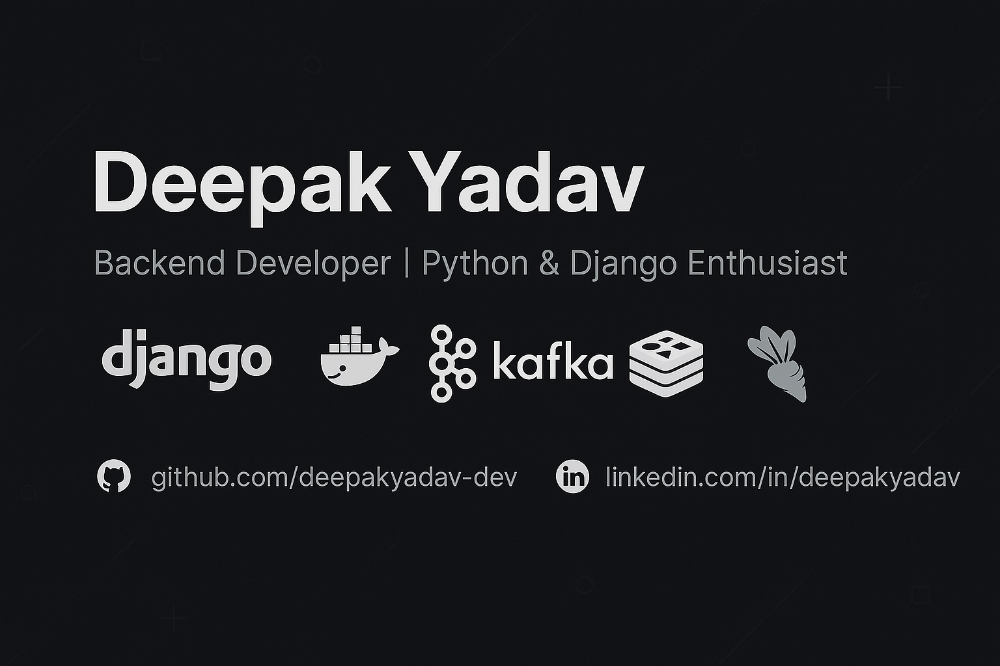

<!-- Banner Image -->

  

# 👋 Hi, I'm Deepak Yadav

🚀 Aspiring Backend Developer | 💻 Python & Django Enthusiast | 🐳 DevOps Learner

---

## 🧠 About Me

- 🔭 I’m currently working on:
  - 🚑 **RescueQR** – A smart emergency info app using Django, DRF, and QR codes.
  - 🧾 **Medical Records App** – Upload and manage medical history & documents with preview.
  - 📋 **Task Status Tracker** – Web app using Django + Celery + Redis + Kafka + Docker.

- 🌱 I’m currently learning:
  - ✅ Django Auth, JWT, Deployment
  - ✅ Kafka, Celery, Redis
  - ✅ DSA (Sorting, Graphs, DP, Trees)

- 💬 Ask me about:
  - Django REST Framework
  - Dockerizing Django projects
  - VPS deployment with Gunicorn & Nginx
  - Celery + Redis + Kafka integration

---

## 📌 Featured Projects

### 🆘 [RescueQR](https://github.com/deepakyadav-dev/rescueqr)
> QR-based emergency app with medical info and contact access.

### 📄 [Medical Records App](https://github.com/deepakyadav-dev/medical-records)
> Store, preview and update insurance & medical PDFs securely.

### 📊 [Task Status Tracker](https://github.com/deepakyadav-dev/task-tracker)
> Async background task system using Celery, Redis & Kafka.

---

## 🎓 Certifications

- Python for Everybody – University of Michigan (Coursera)
- Django for Beginners – JustDjango
- Docker Essentials – CodeAcademy
- Kafka Fundamentals – Conduktor

---

## 📚 Learning Resources I'm Following

- [Django Docs](https://docs.djangoproject.com/)
- [Real Python](https://realpython.com/)
- [FreeCodeCamp DSA Playlist](https://www.youtube.com/c/Freecodecamp)
- [System Design Primer GitHub](https://github.com/donnemartin/system-design-primer)

---

## 🧠 DSA Progress Tracker

- ✅ Sorting Algorithms
- ✅ Linked Lists
- ✅ Stacks & Queues
- ⏳ Trees & Graphs
- ⏳ Dynamic Programming
- ⏳ Hashing

---

## 🛠️ Tech Tools I Use

---

## 📫 Let's Connect

- [GitHub](https://github.com/deepakyadav-dev)
- [LinkedIn](https://linkedin.com/in/deepakyadav)

---

## 📈 GitHub Stats

